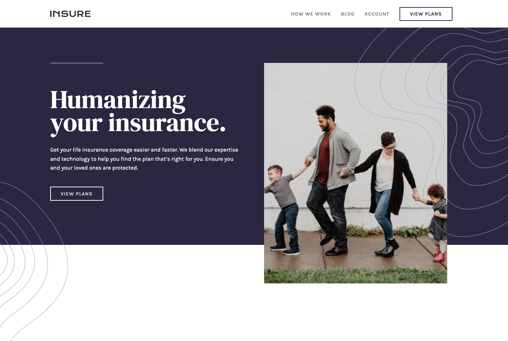

# Frontend Mentor - Insure landing page solution

This is a solution to the [Insure landing page challenge on Frontend Mentor](https://www.frontendmentor.io/challenges/insure-landing-page-uTU68JV8). Frontend Mentor challenges help you improve your coding skills by building realistic projects.

## Table of contents

- [Overview](#overview)
  - [The challenge](#the-challenge)
  - [Screenshot](#screenshot)
  - [Links](#links)
- [My process](#my-process)
  - [Built with](#built-with)
  - [What I learned](#what-i-learned)
  - [Continued development](#continued-development)
  - [Useful resources](#useful-resources)
- [Author](#author)

## Overview

### The challenge

Users should be able to:

- View the optimal layout for the site depending on their device's screen size
- See hover states for all interactive elements on the page

### Screenshot

Mobile

Desktop

### Links

- Solution URL: [https://github.com/kennbach/insure-landing-page](https://github.com/kennbach/insure-landing-page)
- Live Site URL: [https://kennbach.github.io/insure-landing-page/](https://kennbach.github.io/insure-landing-page/)

## My process

### Built with

- Semantic HTML5 markup
- CSS
- CSS Variables
- CSS Grid
- Vanilla JavaScript
- Mobile-First workflow
- Accessibility Aware

### What I learned

Mobile first development may be the industry standard, but it requires a thorough review of the desktop design. Most importantly, before laying down your html foundation and plugging away at the mobile css. In this project a few simple changes to the html code that I wrote for the mobile design would have saved me a lot of effort when coding the desktop css. Perhaps the reality is desktop-first html, mobile-first css?

### Continued development

I plan to take a much more careful look at the design requirements for everything larger than the mobile design, before committing to the html and styling the mobile css.

I'd also like to start finding the right places to use either grid, flex-box, or a mixture of the two. Right now, I tend to stick with my strengths rather than really deciding which is best for the given task.

### Useful resources

- [The Net Ninja: HTML & CSS Crash Course](https://youtube.com/playlist?list=PL4cUxeGkcC9ivBf_eKCPIAYXWzLlPAm6G) - This is a great resource to learn or refresh your HTML and CSS knowledge from the ground up.

- [The Net Ninja: CSS Variables](https://youtube.com/playlist?list=PL4cUxeGkcC9ii5PB2UMyYH7QFZWfGnVgZ) - This is a great resource to learn CSS variables.

- [The Net Ninja: CSS Grid](https://youtube.com/playlist?list=PL4cUxeGkcC9itC4TxYMzFCfveyutyPOCY) - This is a great resource to learn CSS grid.

- [Kevin Powell: Are you using the right CSS units?](https://youtu.be/N5wpD9Ov_To) - There are a lot of different units that we can use when writing CSS, in this video Kevin gives some general rules of thumb of which ones are best suited for which situations. This is also where I learned how to convert the root font-size to base-10.

- [Kevin Powell: Solutions to common struggles](https://www.youtube.com/playlist?list=PL4-IK0AVhVjMbyomzxwNOECQwioJLxX6n) - The title says it all.

- Both, [Kevin Powell](https://www.youtube.com/kepowob) and [The Net Ninja](https://www.youtube.com/c/TheNetNinja) have a virtual-ton of great web app development tutorials. I only listed a few above, but there are many, many more.

## Author

- Github - [kennbach](https://github.com/kennbach)
- Frontend Mentor - [@kennbach](https://www.frontendmentor.io/profile/kennbach)
